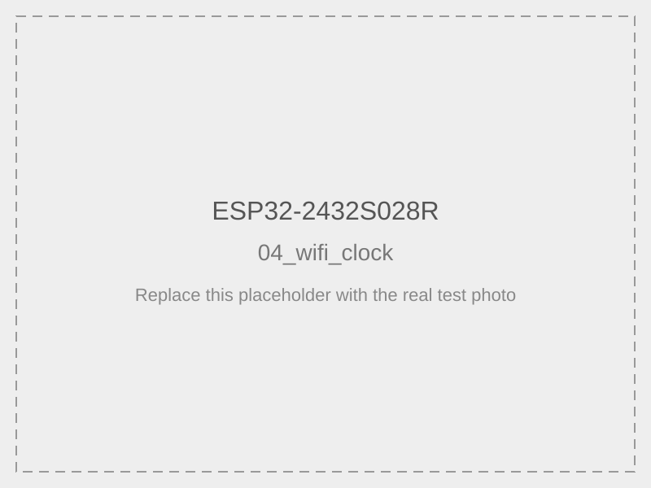

# 04 — Wi-Fi часы с NTP

## Статус

**ПРОВЕРЕНО: РАБОТАЕТ**

Дата проверки: **08.08.2026**

Фактический запуск на ESP32-2432S028R подтверждён как полностью рабочий.

Видеоотчёт:

- [YouTube Shorts — ESP32-2432S028R / CYD Wi-Fi clock](https://youtube.com/shorts/Ys7NKqPrfCg)

Фото результата:



> Сейчас в репозитории находится минимальная SVG-заглушка. Её можно локально заменить реальной фотографией, сохранив то же имя файла.

По фактическому тесту подтверждены:

- TFT работает в landscape-режиме;
- заголовок `CYD Wi-Fi clock` отображается корректно;
- ESP32 подключается к Wi-Fi;
- выполняется синхронизация времени через NTP;
- отображаются дата и текущее время;
- секунды обновляются;
- TFT остаётся стабильным при одновременной работе Wi-Fi и NTP.

Итоговый статус лабораторного теста:

```
TEST_04_WIFI_CLOCK_PASS
WIFI_CONNECTION_CONFIRMED
NTP_TIME_SYNC_CONFIRMED
TIME_OUTPUT_CONFIRMED
DATE_OUTPUT_CONFIRMED
TFT_WIFI_SIMULTANEOUS_OPERATION_CONFIRMED
```

Файл программы: [`04_wifi_clock.ino`](04_wifi_clock.ino)

Пример объединяет:

- подключение ESP32 к Wi-Fi;
- синхронизацию времени через NTP;
- вывод даты и времени на TFT;
- периодическое обновление экрана.

## Что нужно установить до запуска

Перед этим примером должна быть выполнена общая настройка Arduino IDE:

- [Установка Arduino IDE, пакета ESP32 и общая настройка проекта](../../docs/arduino-ide.md)
- [Установка и первая проверка `CYD_Board`](../../libraries/CYD_Board/README.md)
- [Установка и настройка `TFT_eSPI`](../../docs/tft-espi-installation.md)
- [Конфигурация `config/tft_espi/User_Setup.h`](../../config/tft_espi/User_Setup.h)
- успешно пройден [01_display_test](../01_display_test/README.md)

Для этого примера отдельно устанавливать `WiFi`, `time`, `SPI` или `SD` через Library Manager не нужно: `WiFi.h` и `time.h` входят в пакет ESP32 Arduino Core.

`XPT2046_Touchscreen` для этого теста не требуется.

## Проверенный профиль Arduino IDE

Для этой платы используйте уже проверенный профиль проекта:

```
Board: ESP32 Dev Module
CPU Frequency: 240 MHz
Flash Frequency: 40 MHz
Flash Mode: DIO
Flash Size: 4 MB
Upload Speed: 115200
```

Если локальная общая инструкция содержит альтернативные параметры, для данной лаборатории приоритет имеют именно эти фактически проверенные значения.

## Требования

- доступна сеть Wi-Fi **2,4 ГГц** с выходом в интернет;
- создан локальный файл `secrets.h`;
- TFT_eSPI настроена нашим `User_Setup.h`;
- `CYD_Board` доступна Arduino IDE.

ESP32 этой платы не подключается к сети 5 ГГц напрямую. Нужна точка доступа или роутер с сетью 2,4 ГГц.

## Подготовка `secrets.h`

В папке примера уже есть шаблон:

- [`secrets.example.h`](secrets.example.h)

Скопируйте его как:

```
secrets.h
```

и заполните своими данными:

```
#pragma once

#define WIFI_SSID "имя_вашей_сети"
#define WIFI_PASSWORD "пароль_вашей_сети"
```

### Вариант через Проводник Windows

1. Откройте папку `examples/04_wifi_clock`.
2. Скопируйте `secrets.example.h`.
3. Переименуйте копию в `secrets.h`.
4. Откройте файл в текстовом редакторе.
5. Впишите SSID и пароль.

### Вариант через PowerShell

Из корня репозитория:

```
Copy-Item ".\examples\04_wifi_clock\secrets.example.h" `
  ".\examples\04_wifi_clock\secrets.h"
```

После этого откройте `secrets.h` и замените:

```
YOUR_WIFI_NAME
YOUR_WIFI_PASSWORD
```

на реальные данные вашей сети.

Не публикуйте настоящий `secrets.h` в Git и не вставляйте реальные Wi-Fi credentials в README, issue или видео.

## Часовой пояс

В исходном примере установлено UTC:

```
constexpr long GMT_OFFSET_SECONDS = 0;
constexpr int DAYLIGHT_OFFSET_SECONDS = 0;
```

Для постоянного смещения измените `GMT_OFFSET_SECONDS`.

Например, UTC+3:

```
constexpr long GMT_OFFSET_SECONDS = 3 * 3600;
```

Автоматические сезонные переходы этот минимальный пример не реализует. Для полноценной локальной временной зоны лучше использовать TZ-строку в отдельном расширенном примере.

## Запуск

1. Убедитесь, что `CYD_Board` установлена.
2. Убедитесь, что `TFT_eSPI` установлена и применён наш `User_Setup.h`.
3. Создайте и заполните `secrets.h`.
4. Откройте [`04_wifi_clock.ino`](04_wifi_clock.ino).
5. Выберите **ESP32 Dev Module**.
6. Проверьте настройки Flash: **40 MHz / DIO / 4 MB**.
7. Установите Upload Speed **115200**.
8. Нажмите **Verify**.
9. Нажмите **Upload**.
10. После запуска наблюдайте сообщения и время на TFT.

## Ожидаемый результат

Сначала экран показывает:

```
Connecting to Wi-Fi...
```

После успешного подключения и запуска сетевой синхронизации появляется:

```
Time synchronized
```

Затем крупно отображается время:

```
12:34:56
```

и ниже дата:

```
2026-08-08
```

Экран обновляется примерно четыре раза в секунду.

## Критерий успеха

Пример считается работающим, если:

- плата подключается к указанной Wi-Fi сети;
- не появляется окончательное сообщение `Wi-Fi connection failed`;
- после NTP-синхронизации появляются правдоподобные дата и время;
- секунды увеличиваются без постоянных зависаний и reset;
- TFT остаётся стабильным во время работы Wi-Fi.

## Типичные проблемы

### `secrets.h: No such file or directory`

Создайте `secrets.h` копированием [`secrets.example.h`](secrets.example.h) по инструкции выше.

### `Wi-Fi connection failed`

Проверьте:

- правильность SSID и пароля;
- наличие сети 2,4 ГГц;
- уровень сигнала;
- отсутствие captive portal;
- что `secrets.h` находится в той же папке, что `04_wifi_clock.ino`.

Тайм-аут подключения в скетче составляет около 20 секунд.

### Время не появляется после подключения

Проверьте доступ в интернет, DNS и доступность NTP.

Используются серверы:

```
pool.ntp.org
time.nist.gov
```

### Время сдвинуто на несколько часов

Настройте `GMT_OFFSET_SECONDS`. Текущий исходник использует UTC.

### TFT работает неправильно

Сначала вернитесь к:

- [01_display_test](../01_display_test/README.md)
- [инструкции TFT_eSPI](../../docs/tft-espi-installation.md)
- [`CYD_Board`](../../libraries/CYD_Board/README.md)

и убедитесь, что базовый дисплейный тест проходит отдельно от Wi-Fi.

## Ограничения

Пример не реализует:

- автоматический выбор часового пояса;
- DST по календарным правилам;
- повторное подключение после длительной потери Wi-Fi;
- автономные часы RTC;
- сохранение последнего времени;
- пользовательское меню для безопасного ввода Wi-Fi.

## Видео подтверждения

Видео успешного запуска этого теста:

- https://youtube.com/shorts/Ys7NKqPrfCg

## Возврат к списку

Все примеры: [examples/README.md](../README.md).
